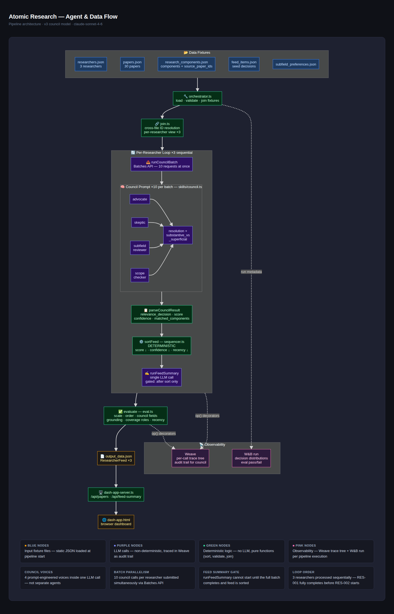

# Atomic Research

> An AI agent research team that decides what is worth a researcher's attention — and defends every decision out loud.

Most tools answer *"what is new?"* Atomic Research answers *"what is worth your attention, and here is the argument for it."

* In a world optimizing for more and faster, we optimized for **right**.

## Project Description

Everyone else is racing to do research faster. We think that is the wrong race. More is published each day than any researcher can read, and discovery tools made it worse. They optimize for recall — embeddings, cosine similarity, *"here are 200 papers that matched your keywords."* That is a faster firehose, and a researcher buried in relevant-ish results is still buried.

The reason keyword and vector tools fail is that **"relevant to me, right now" is not a number you can compute. It is an argument you have to make.** A cosine score cannot tell the difference between a paper that extends your sparse-autoencoder research and one that just says "sparse" a lot. So we stopped computing relevance and started deliberating it.

### 🧩 A team of agents, not a model call

Atomic Research runs a **council**. Specialized agents each read a paper against who you actually are as a researcher, argue it from different angles, and reach a verdict together. The output is not a score — it is a decision with a paper trail. Open any verdict and watch the reasoning that produced it, **including the dissent**. The feed tells you what is worth your attention, defends why, and is willing to say no.

### 🔍 Grounded in your real work, and adversarially checked

A council that decides what matters to you is only as good as its picture of you, so we refused to let it guess. Before it runs, Atomic Research reads your actual body of work and grounds its understanding of you in real papers. Every claim about your research threads has to cite the specific publications that prove it. Then a separate validation agent runs a gauntlet: it checks each claim against your real corpus and rejects any fabricated lineage before it can reach a recommendation.

## Demo Video

<!-- Replace with your demo video link -->
[▶️ Watch the demo](VIDEO_URL_HERE)

## Partner Technologies Used

We used **[Weave](https://wandb.ai/site/weave)** to record every AI call and data fetch, so the entire pipeline is traceable. It starts once at launch — `weave.init` in `run.ts`, before anything else runs — and from there it automatically captures every Anthropic model call: the grounding, the council deliberations, and the feed summaries, with no extra instrumentation. The key supporting functions — the data fetch, the transforms, the integrity checks, and the eval gates — are tagged with `@weave.op()` so they surface in the same trace tree.

This matters because the system is non-deterministic where it counts. The AI steps reason rather than compute, and the data fetch is a live network call, so there is no single deterministic path to point to after the fact. **Weave's trace _is_ the audit trail.** It proves what the system decided and why — and it guarantees that any failure or degraded state is logged and visible, never silent. It runs alongside **[W&B](https://wandb.ai)**, which logs the higher-level per-run metrics, with both pointing to the same run for cross-reference.

## Agentic Architecture

Atomic Research is built as a pipeline of **bounded, single-purpose agents**, each of which must show its work. There is no monolithic "rank these papers" model call. Instead, distinct agentic stages run in a strict, enforced order, and every stage is fully traced.

### 🌐 Live fetch boundary

The pipeline begins at a **live fetch boundary** to OpenAlex. From a single confirmed author identity — the one human decision in the whole flow — the system pulls the researcher's profile, their own body of work, and a candidate pool of recent papers in their subfields. This boundary is deliberately sealed: it consumes live network data, normalizes it, and emits clean records, but it never lets a network failure crash the pipeline — a failed call **degrades to empty and is logged, never silent.**

### 🧬 Grounding, validated not trusted

A **grounding stage** reads the researcher's own publications and uses an LLM to extract their research threads — but nothing it claims is taken on trust. A second validation agent audits every claim, and a deterministic gate rejects any research thread that cites a paper not actually in the researcher's corpus. This is what separates genuine intellectual lineage from a plausible-sounding hallucination: **the profile is _earned_ from real evidence, not asserted.**

### ⚖️ The council

Only then does the **council** run — multiple specialized agents that deliberate over each candidate paper against the grounded profile and reach a verdict together, **with the dissent preserved.** The council decides; it does not compute a score. A final stage produces a per-researcher editorial summary.

### 📐 Self-documenting, explainable by construction

Critically, the entire system was **built from a specification, not hand-coded.** Using the **Cascadia spec-driven Console**, the requirements cascade down through strategy, architecture, and build instructions — each layer generated from the one above it. The result is an application that is **self-documenting**: the same specification that governs what the system does also explains why it does it, end to end.

Combined with full Weave tracing of every agent decision, fetch, and validation step, Atomic Research is **explainable by construction** — every output can be traced back through the agent that produced it, the evidence it used, and the specification that authorized it.